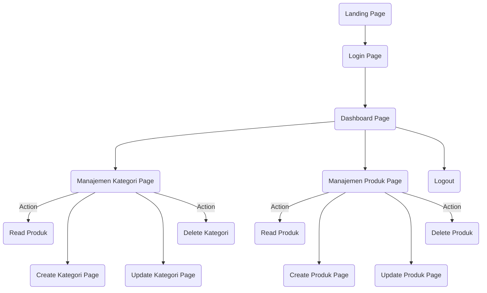

<!-- inspiring README PROJECTS -->

<!-- https://github.com/ma-shamshiri/Spam-Detector/blob/master/README.md -->
<!-- https://github.com/aregtech/areg-sdk/blob/master/README.md -->


<a name="top"></a>

<div align="center">
<!-- Logo Aplikasi -->
<!--  -->
<!--  -->

# Akiong Warehouse
### Kelompok 7<br>Website Iventaris
<p>Projek Akhir - Praktikum Framework</p>


| NIM | NAMA | ROLE |
|------------|:----------------------:|:---------:|
| 2109106043 | Hadie Pratama Tulili | `Ketua` |
| 2109106052 | Muhammad Firdaus | `Anggota` |
<br>
</div>


## Table Of Content
 - [Introduction](#introduction)
 - [Alur Program](#alur-program)
 - [Job Desk](#job-desk)
 - [Features](#features)


## Introduction
<!-- tentang aplikasi -->


## Job Desk
<br>
<div align=center>

| NIM | NAMA | JOB DESK |
|-----|:--------------------:|:--------: |
| 2109106043 | Hadie Pratama Tulili | `FE&BE Landing Page`<br>`FE&BE Manajemen Data Page`|
| 2109106052 | Muhammad Firdaus |`FE&BE Register Page`<br>`FE&BE Login Page`|

</div>
<br>

## Alur Program
<strong>Alur Manager</strong>

```mermaid
graph
  A(Landing Page)-->B(Login Page);
  B-->C(Regist Page);
  B--->D(Dashboard Page);
  D--->E(Kategori Page);
  D--->F(Produk Page);
  D--->G(Manajemen Pemasok Page);
  G--Action-->H)(Read Pemasok);
  G--->I(Create Pemasok Page);
  G--->J(Update Pemasok Page);
  G--Action-->K(Delete Pemasok);
  G--->L(Print Data Page);
  D-->M(Logout);
```

<br>
<strong>Alur Manager<br><br></strong>




<br>


## Features
Fitur-fitur yang tersedia pada website Akiong Warehouse :
+ Authetication
+ Management Data
+ Print Data

</div>
